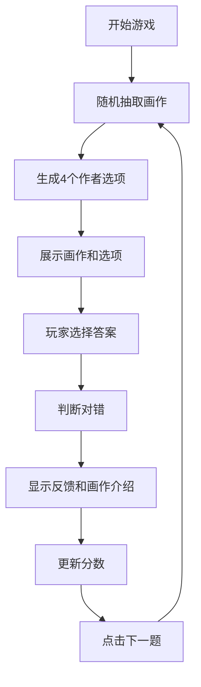

## 1. 产品概述

艺术侦探（Art Detective）是一款轻量级的艺术知识问答游戏。玩家通过观察一幅画作，从 4 个选项中猜出这幅作品的作者，在游戏过程中学习艺术史知识。

- 目标用户：对艺术感兴趣的普通大众、学生、艺术爱好者
- 产品价值：用轻松有趣的方式普及艺术知识，寓教于乐

---

## 2. 核心功能

### 2.1 功能模块

1. **游戏主页面**：画作展示、作者选项、答题反馈、分数统计、下一题

### 2.2 页面详情

| 页面名称 | 模块名称 | 功能描述 |
|----------|----------|----------|
| 游戏主页面 | 画作展示 | 随机展示一幅画作的高清图片，居中显示 |
| 游戏主页面 | 作者选项 | 展示 4 个作者姓名按钮（1 个正确 + 3 个错误），点击即作答 |
| 游戏主页面 | 答题反馈 | 选择后显示答对/答错状态，并展示画作介绍（作者、年代、画派、背景） |
| 游戏主页面 | 分数统计 | 顶部显示当前答对题数、总题数、正确率 |
| 游戏主页面 | 下一题按钮 | 看完反馈后点击进入下一题 |

---

## 3. 核心流程

玩家进入游戏 → 系统随机抽取一幅画作 → 生成 4 个作者选项（打乱顺序）→ 玩家点击选项 → 显示对错反馈和画作介绍 → 更新分数 → 点击"下一题" → 循环。

---

## 4. 用户界面设计

### 4.1 设计风格

- **主色调**：深米色 `#F5F1E8` 作为背景（画布质感），搭配深棕褐色 `#3E2C20` 文字，营造博物馆/画廊氛围
- **强调色**：深金 `#B8860B`（答对提示）、砖红 `#A0522D`（答错提示）
- **按钮风格**：圆角矩形，轻微阴影，悬停时有微妙的上浮和金色边框高亮
- **字体**：标题使用古典衬线字体（如 Playfair Display），正文使用优雅无衬线字体（如 Lora）
- **布局风格**：卡片式布局，居中展示，大量留白，突出画作本身
- **装饰**：细金色分隔线，画作外框带仿画框阴影

### 4.2 页面设计概览

| 页面名称 | 模块名称 | UI 元素 |
|----------|----------|----------|
| 游戏主页面 | 顶部标题区 | 游戏 Logo "艺术侦探"、当前分数面板（答对/总数/正确率） |
| 游戏主页面 | 画作展示区 | 大幅画作居中，带精致画框阴影效果，下方显示画作名称 |
| 游戏主页面 | 选项区 | 2×2 网格排列的 4 个作者按钮，等宽等距 |
| 游戏主页面 | 反馈区 | 答对：绿色勾选图标 + 正确提示；答错：红色叉号 + 正确答案；下方展示画作信息卡片 |
| 游戏主页面 | 底部操作 | "下一题"按钮，金色强调 |

### 4.3 响应式设计

- 桌面端（默认）：画作最大宽度 600px，选项 2×2 网格
- 平板端：画作最大宽度 100%，选项保持 2×2
- 移动端：画作宽度 100%，选项改为单列纵向排列，字号相应缩小

---
