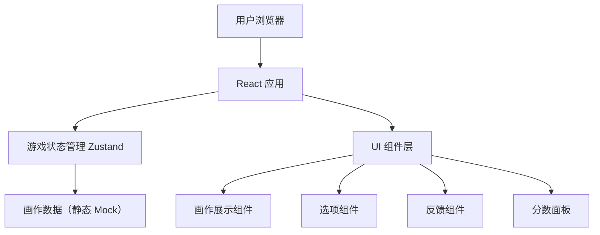

## 1. 架构设计

本项目为纯前端项目，无后端服务，画作数据以静态 JSON 方式存在前端。



---

## 2. 技术说明

- **前端框架**：React 18 + TypeScript
- **构建工具**：Vite
- **样式方案**：Tailwind CSS 3
- **状态管理**：Zustand（轻量级，避免过度设计）
- **数据**：内置 Mock 数据（约 10~15 幅名画信息），画作图片使用公开艺术资源 URL

---

## 3. 路由定义

| 路由 | 用途 |
|------|------|
| `/` | 游戏主页面（唯一页面） |

---

## 4. 数据模型

### 4.1 数据定义

```typescript
interface Painting {
  id: string;
  title: string;           // 画作名称
  titleEn: string;         // 画作原名（英文）
  artist: string;          // 作者
  year: string;            // 创作年代
  movement: string;        // 画派/艺术运动
  imageUrl: string;        // 画作图片 URL
  description: string;     // 作品背景简介（1~2 句）
}

interface GameState {
  currentPainting: Painting | null;  // 当前题目画作
  options: string[];                 // 4 个选项（打乱顺序）
  selectedAnswer: string | null;     // 玩家选择的答案
  isAnswered: boolean;               // 是否已作答
  score: number;                     // 答对数量
  total: number;                     // 总题数
}
```

### 4.2 Mock 数据来源

画作图片使用以下公开资源（均为公共领域作品）：
- 维基共享资源（Wikimedia Commons）
- Google 艺术计划公开图片
- 荷兰国立博物馆（Rijksmuseum）公开 API 图片

内置约 10~15 幅经典作品，涵盖：梵高、莫奈、达芬奇、毕加索、米开朗基罗、伦勃朗、 Klimt、马蒂斯、塞尚、达利等。

---

## 5. 项目目录结构

```
src/
├── data/
│   └── paintings.ts       // 画作 Mock 数据
├── components/
│   ├── PaintingCard.tsx   // 画作展示组件
│   ├── OptionButton.tsx   // 选项按钮组件
│   ├── FeedbackPanel.tsx  // 答题反馈组件
│   └── ScoreBoard.tsx     // 分数面板组件
├── store/
│   └── useGameStore.ts    // Zustand 游戏状态
├── utils/
│   └── gameLogic.ts       // 题目生成、随机抽取等工具函数
├── pages/
│   └── GamePage.tsx       // 游戏主页面
├── App.tsx
├── main.tsx
└── index.css
```

---

## 6. 状态流转说明

1. 初始化：加载所有画作数据 → 随机抽取第一题 → 生成 4 个选项
2. 玩家作答：点击选项 → 标记已作答 → 更新分数
3. 下一题：点击按钮 → 重新抽取未答过的画作（避免近期重复）→ 生成新选项
4. 反馈展示：显示对错状态、画作详细信息

---
